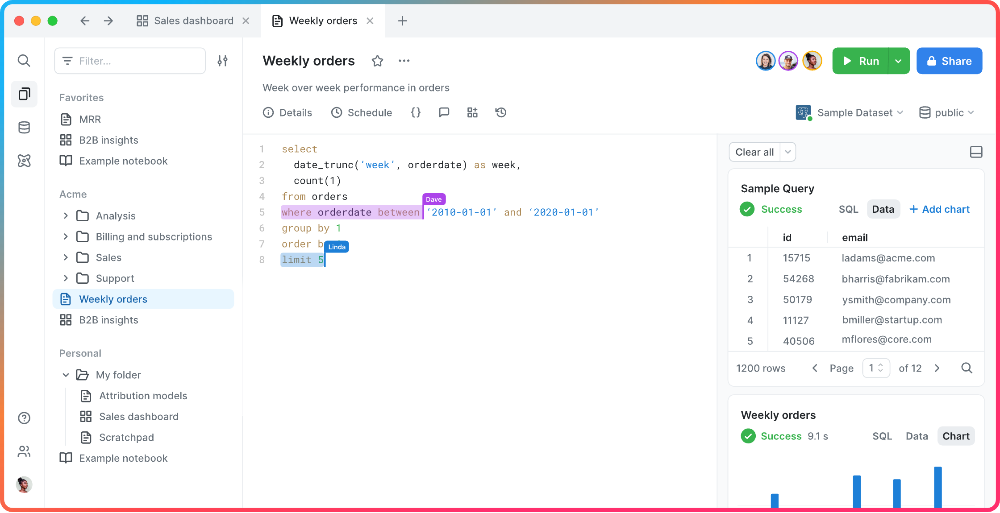
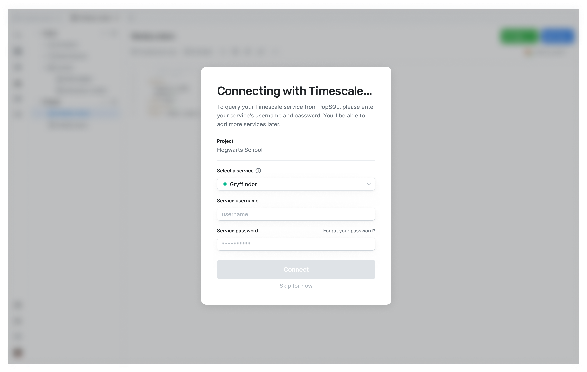
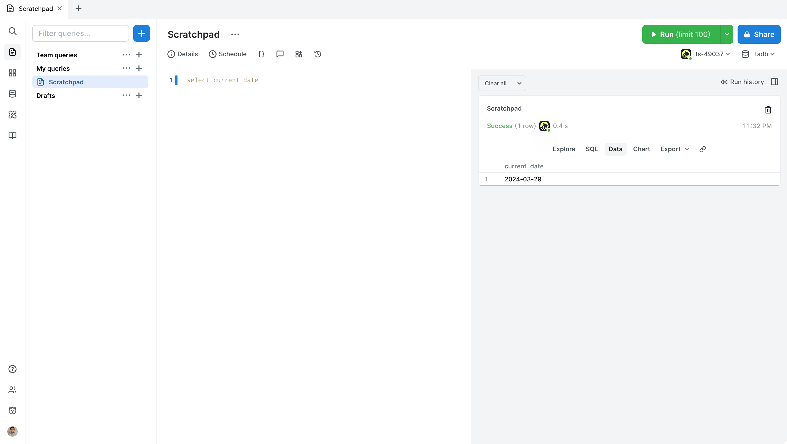

# PopSQL

[PopSQL](https://popsql.com) is Timescale's SQL editor that lets you write
queries, visualize data, and share your results. Key features include:

- Works as a [web app](https://app.popsql.com) or [desktop
  app](https://popsql.com/download) (macOS, Windows, Linux)
- Connect to PostgreSQL, Timescale, Redshift, Snowflake, BigQuery, MySQL, SQL
  Server, [and more](https://popsql.com/connections)
- Real-time collaboration: Collaborate with your team directly in the SQL query
  editor with live presence and multiple cursors.
- [Schema browser](https://docs.popsql.com/docs/schema): Understand the
  structure of your database and see usage data on tables and columns.
- Autocomplete: Get suggestions as you type your queries.
- [Version history](https://docs.popsql.com/docs/version-history): Use the
  built-in revision history, or connect to a git repo if you prefer.
- [Charts](https://docs.popsql.com/docs/creating-charts): Visualize data right
  within your SQL editor rather than switching to Sheets or Excel.
- [Dashboards](https://docs.popsql.com/docs/creating-dashboards): Create
  beautiful SQL-based dashboards.
- [Schedules](https://docs.popsql.com/docs/scheduled-queries): Automatically
  refresh queries and dashboards to create push alerts.
- [Query variables](https://docs.popsql.com/docs/query-variables): Use Liquid to
  parameterize your queries or use `if` statements.

## Get started

### 1. From Timescale Console, click PopSQL

Log into [Timescale Console](https://console.cloud.timescale.com/), and click
the `PopSQL` button in the top right. You may be prompted to sign into Timescale
again.

### 2. Confirm you want to create a PopSQL account

If this is your first time using PopSQL, you'll be asked to confirm that you
want to create a PopSQL account. This will also create a new PopSQL organization
associated with your Timescale project.

If you already have a PopSQL user account with the same Timescale email address,
we'll use that existing PopSQL account.

### 3. Enter your service credentials

Choose a service to connect to, enter its username (eg `tsdbadmin`) and
password, then hit `Connect`.

<Highlight type="note"> If your service is within a VPC, see [What if my service
is within a VPC?](#what-if-my-service-is-within-a-vpc) below. </Highlight>

### 4. Run a test query

At this point, you've successfully connected PopSQL to your Timescale service!
Try running a test query like `select current_date`.

Some useful documentation on things to do within PopSQL:

- [Writing a query](https://docs.popsql.com/docs/writing-a-query)
- [Sharing a query with your
  teammates](https://docs.popsql.com/docs/sharing-a-link-to-your-query-and-results)
- [Creating a chart from your
  data](https://docs.popsql.com/docs/creating-charts)
- [Creating a dashboard of multiple query
  results](https://docs.popsql.com/docs/creating-dashboards)
- [Creating schedules for your
  queries](https://docs.popsql.com/docs/scheduled-queries)

## FAQ

### How do I access PopSQL?

#### From the header

In Timescale Console, click the `PopSQL` button in the top right.

#### From project settings

In Timescale Console, click on `Project settings`, and click `View Project in
PopSQL`. This will resync your Timescale project with your PopSQL organization,
adding any new services that might have been created.

#### Directly at app.popsql.com

Once you've connected your Timescale account to PopSQL, you can access PopSQL
directly at [app.popsql.com](https://app.popsql.com) or use the [desktop
app](https://popsql.com/download).

### What if my service is within a VPC?

If you run your service within a VPC, you will need to either:

- Use PopSQL's [bridge connector](https://docs.popsql.com/docs/bridge-connector)
- Use an SSH tunnel
  - When configuring the connection in PopSQL, under `Advanced Options`, you'll
    see `Connect over SSH`
- Add PopSQL's static IPs (`23.20.131.72, 54.211.234.135`) to your allowlist

### What happens if another member of my Timescale project opens PopSQL?

They will have a PopSQL user account created for them and be automatically added
to the PopSQL organization you created. They will need to input their own
credentials for each service/connection, unless you [share the connection within
PopSQL](https://docs.popsql.com/docs/shared-connections).

### Will using PopSQL affect the performance of my Timescale service?

There are a few factors to consider:

1. What instance size is your database?
1. How many users are running queries?
1. How computationally intensive are the queries?

If you have a small number of users running performant SQL queries against a
service with sufficient resources, then there should be no degradation to
performance.

However, if you have a large number of users running queries, or if the queries
are computationally expensive, then you'll likely want to create a replica and
send analytical queries there instead.

If you'd like to prevent write operations (e.g. insert, update, etc), instead of
using the `tsdbadmin` superuser, create a read-only user for your service and
use that within PopSQL.

### How does pricing work?

PopSQL has a free plan available to everyone, as well as paid plans.

Timescale Cloud customers get PopSQL's Business plan for free for up to 10
users.

Please refer to [PopSQL's Pricing page](https://popsql.com/pricing) for full
details.
